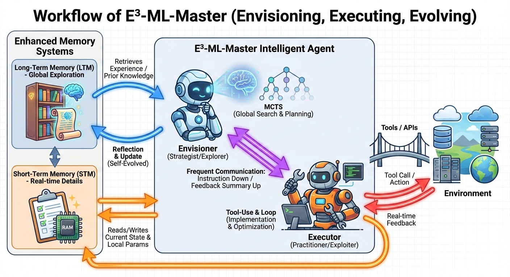

# $E^3$-ML-Master: Advanced Envisioning-Executing for Goal-Driven Self-Evolved ML-Master

<div align="center">
  
</div>

## Project Overview

> [!NOTE]
> Derived from ML Agent: [**ML-Master**](https://github.com/sjtu-sai-agents/ML-Master)

E³-ML-Master is a long-horizon, self-evolved ML agent framework that uses Monte Carlo Tree Search (MCTS) and LLM-driven code generation to solve machine learning competition tasks. The framework employs a dual-core design: **Envisioner** (global exploration decision maker) and **Executor** (parallel execution engine).

### Core Components

- **Envisioner** (`framework/agent.py`): Maintains the global MCTS search tree, coordinates multiple parallel Executors, manages global Memory system, tracks global best node
- **Executor** (`framework/agent.py`): Executes strategy code for specific nodes, uses LLM to extract metrics from execution output, supports multi-turn refinement for code optimization
- **MCTSNode** (`framework/node.py`): Represents a strategy in the search tree with fields for visits, expansion, rewards, and UCT calculation
- **Memory** (`framework/memory.py`): Context-aware memory system storing all exploration history with indexed retrieval
- **Interpreter** (`interpreter/interpreter_parallel.py`): Parallel code execution engine that runs Python code in isolated environments
- **Backend** (`backend/`): LLM API interface layer supporting OpenAI-compatible and Qwen backends


## Quick StartUp

### Environment SetUp

```bash
uv sync
source .venv/bin/activate
# Python 3.13.5
```

### APIKEY SetUp

By default, we use `deepseek-v3.2` (`deepseek-chat`) for the backbone of `Executor` Agent for writing codes and instruction followings, and we use `deepseek-r1` (`deepseek-reasoner`) for the backbone of core `Envisioner` Agent for self-reflection and expanding new strategies. 

- `OPENAI_API_KEY` with deepseek backbone: [Official API](https://platform.deepseek.com/usage)
- `SERPER_API_KEY` for web search and web parse tool calling. [SERPER_DEV](https://serper.dev/api-keys)

Write the following api keys into `.env` file.

```env
OPENAI_API_KEY="Your key"
BASE_URL="https://api.deepseek.com"
SERPER_API_KEY="Your key"
```

## Usage

```bash
python main.py
```

## Detailed Workflow

<div align="center">
  
</div>

> [!IMPORTANT]
> All the source code of the new architecture is in `framework` folders.